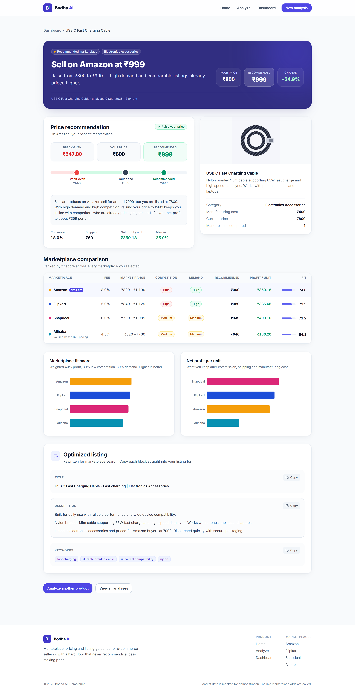

# Bodha AI

**AI-powered marketplace recommendation engine for e-commerce sellers.**

Bodha AI answers three questions about a product in one pass — **where** to sell it,
**what** to charge, and **how** to write the listing — and it will never recommend a
price that loses the seller money.



---

## Quick start

```bash
# 1. Install both packages
npm run install:all
npx --prefix backend playwright install chromium

# 2. Copy the env templates (defaults work as-is for local development)

# 2. Copy the env templates (defaults work as-is for local development)
cp backend/.env.example backend/.env
cp frontend/.env.example frontend/.env

# 3. Run the API (:4000) and the web app (:5173) together
npm run dev
```

Then open **http://localhost:5173**.

Prefer two terminals? `npm run dev:backend` and `npm run dev:frontend`.

| Command | What it does |
|---|---|
| `npm run dev` | Runs API + web app together |
| `npm test` | Runs the backend unit + API test suites (live scrapes skipped) |
| `npm run lint` | ESLint across both packages |
| `npm run format:check` | Prettier check across both packages |
| `npm run build` | Type-checks and builds both packages for production |

**Requirements:** Node.js 22.5+ (the API uses the built-in `node:sqlite` module, so
there is no native build step). Developed and verified on Node 26.

---

## Architecture

```
bodha-ai/
├── backend/                     Node + Express + TypeScript REST API
│   └── src/
│       ├── routes/              HTTP layer only
│       ├── services/
│       │   ├── pricingEngine.ts            pure business logic, unit tested
│       │   ├── listingOptimizer.ts         pure listing rewriter, unit tested
│       │   ├── snapshotFromListings.ts     demand/competition heuristics
│       │   ├── marketplaceDataProvider.ts  cache-first then Playwright scrape
│       │   ├── cacheService.ts             SQLite listing cache
│       │   ├── analysisService.ts          IDs, clock, persistence
│       │   └── scraper/                    Amazon / Flipkart / Snapdeal adapters
│       ├── models/              SQLite schema + repository (all SQL lives here)
│       ├── data/                platformConfig.ts (fees) + categories.ts
│       ├── utils/               zod validation + structured HTTP errors
│       └── tests/               Vitest suites (live scrape tests skipped by default)
└── frontend/                    React + Vite + TypeScript + Tailwind
    └── src/
        ├── pages/               Home, Analyze, Report, Dashboard, NotFound
        ├── components/          layout/, analyze/, report/, ui/
        ├── hooks/               React Query bindings + form state
        ├── services/api.ts      the ONLY place that calls fetch
        └── types/               response-facing types
```

The design rule throughout: **`pricingEngine` and `listingOptimizer` are pure
functions.** They take data and return data — no HTTP, no database, no clock, no
UI. Comparable listings come from `marketplaceDataProvider` (live scrape or
cache). Everything impure (IDs, timestamps, persistence, Playwright) stays out
of the pricing engine. That is what makes the business rules unit-testable.

### Request flow

```
Analyze form → services/api.ts → POST /api/products/analyze
                                      ↓
                             zod validation (400 on failure)
                                      ↓
              marketplaceDataProvider.getMarketSnapshots()
                 cache HIT → cached listings
                 else Playwright scrape (Amazon / Flipkart / Snapdeal)
                 scrape fail → stale cache, or "unavailable"
                                      ↓
                    pricingEngine.analyzePricing(snapshots)  ← pure
                                      ↓
                    listingOptimizer.optimizeListing()  ← pure
                                      ↓
                         saveAnalysis() → SQLite
                                      ↓
                    201 + full report → React Query cache → /report/:id
```

---

## The pricing logic

For each selected marketplace:

| Step | Formula |
|---|---|
| Market price | `median(comparable listing prices)` for that category × platform |
| **Break-even floor** | `manufacturingCost / (1 - feePercent) + avgShippingFee` |
| Recommended price | `max(marketPrice, breakEvenPrice)` — clamped, never below the floor |
| Estimated profit | `price - price × feePercent - avgShippingFee - manufacturingCost` |
| Fit score (0–100) | `0.4 × normalize(profit) + 0.3 × (100 - competition) + 0.3 × demand` |

Platforms are ranked by fit score; the top one becomes the **Recommended
Marketplace**. The weights, the 35% target margin used to normalise profit, and the
±10% re-pricing dead-band are all exported constants in
[`pricingEngine.ts`](backend/src/services/pricingEngine.ts) so they are easy to tune.

**Price advice** compares the seller's current price to the recommendation:
below 90% → `increase`, above 110% → `decrease`, otherwise `hold`. Every
recommendation ships with a plain-English explanation citing the evidence behind
it — comparable listings, demand, competition, or the break-even floor.

### The loss-prevention guarantee

If comparable products sell *below* what the seller can afford to charge, Bodha AI
does not follow the market down. It floors the recommendation at break-even, sets
`lossRiskAvoided: true`, and says so in the UI with a "Loss protection applied"
notice explaining why.

> **A note on the break-even formula.** As specified, the flat shipping fee is added
> *after* the cost is grossed up for commission, rather than being grossed up itself.
> At exactly the floor this leaves `feePercent × avgShippingFee` uncovered (₹10.80 on
> Amazon at a ₹60 shipping fee). The guarantee this floor backs — *manufacturing cost
> plus platform fees is always recovered* — holds in full, and the residual is
> asserted explicitly in the tests. `zeroProfitPrice()` exposes the stricter
> `(cost + shipping) / (1 - fee)` figure for reference. See the `KNOWN RESIDUAL` note
> on `calculateBreakEvenPrice`.

---

## What is mocked vs. real

| Piece | Status |
|---|---|
| Marketplace comparable prices, demand, competition | **Live scrape + cache.** Playwright reads Amazon.in, Flipkart and Snapdeal search results at query time. Fresh snapshots are reused for `CACHE_TTL_HOURS` (default 3). If a scrape is blocked or times out, the last cached snapshot is used and the UI shows a "last updated" badge. Alibaba is not scraped (B2B, out of scope) and appears as "Data temporarily unavailable". |
| Pricing engine | **Real.** Every number in the report is computed from your inputs plus the live/cached listings by the formulas above. |
| Listing optimizer | **Rule-based stub.** Deterministic templates, not a live LLM — see below. |
| Persistence | **Real.** SQLite on disk; history and the listing cache survive a server restart. |
| Authentication | **Mocked.** One fixed `demo-seller` session; login is out of scope. |
| Payments | Not implemented — out of scope. |

Commission rates sit inside each marketplace's real-world published band (Amazon
15–20%, Flipkart 12–18%, Snapdeal 8–12%, Alibaba 3–6%). Those fees are commercial
config, not scraped — search pages do not publish the seller commission.

**demandIndex** and **competitionIndex** are heuristics derived from scraped
fields, not scores the platforms publish:

- `demandIndex = 100 × log10(1 + avg reviewCount) / log10(1 + 10000)`
- `competitionIndex = 100 × listingCount / 20` (page-1 density, cap 20)

See `backend/src/services/snapshotFromListings.ts`.

### Live scrape behaviour

- One shared headless Chromium; a fresh browser context per request.
- One-at-a-time queue per marketplace (never concurrent Amazon scrapes).
- CAPTCHA / bot-check pages are detected and fall back immediately — they are not bypassed.
- `GET /api/health` reports cache size and TTL. `DELETE /api/cache` clears the listing cache so the next analyze is forced live (useful for demos).
- Selectors were verified against live search pages on 2026-09-09 (`backend/scripts/probe-marketplaces.mjs`). Re-run that script if a marketplace layout changes.
- After `npm install`, run `npx playwright install chromium` once.

Live scrape integration tests are skipped in `npm test`. To run them (sparingly):

```bash
cd backend
# PowerShell
$env:LIVE_SCRAPE=1; npm run test:live-scrape
```

### Swapping the listing optimizer for a real LLM

[`listingOptimizer.ts`](backend/src/services/listingOptimizer.ts) exports a single
function with the signature a real implementation would have:

```ts
(input: ListingOptimizerInput) => Promise<OptimizedListing>
```

Write an `llmOptimizer` with that signature and change the one line marked
`SWAP POINT`:

```ts
export const optimizeListing = process.env.LLM_API_KEY ? llmOptimizer : ruleBasedOptimizer;
```

Nothing else changes — `analysisService` only ever calls `optimizeListing`. Set
`LLM_API_KEY` in `backend/.env`; `GET /api/health` reports which one is active.

---

## API

Base URL `http://localhost:4000`. All errors return
`{ "error": { "code", "message", "details?" } }` with a matching HTTP status.

### `POST /api/products/analyze` → `201`

```jsonc
// request
{
  "title": "USB C Fast Charging Cable",
  "description": "Nylon braided 1.5m cable supporting 65W fast charge.",
  "category": "electronics-accessories",
  "imageUrl": null,                    // or a data: URL
  "manufacturingCost": 400,
  "currentPrice": 800,
  "platforms": ["amazon", "flipkart", "snapdeal", "alibaba"]
}
```

```jsonc
// response (abridged)
{
  "productId": "cb7fbc23-…",
  "recommendedPlatform": "amazon",
  "platforms": [
    {
      "name": "Amazon", "feePercent": 0.18, "marketPriceRange": [899, 1199],
      "recommendedPrice": 999, "breakEvenPrice": 547.8,
      "estimatedProfit": 359.18, "profitMargin": 0.3595,
      "competition": "High", "demand": "High", "fitScore": 74.8,
      "priceAction": "increase", "explanation": "Similar products on Amazon sell…",
      "lossRiskAvoided": false
    }
  ],
  "optimizedListing": { "title": "…", "description": "…", "keywords": ["fast charging", "…"] }
}
```

### `GET /api/products/history` → `200`

Newest-first list of `{ productId, title, thumbnail, category, recommendedPlatform, recommendedPrice, createdAt }`.

### `GET /api/products/:id` → `200` / `404`

The full stored analysis, same shape as the POST response.

### Supporting endpoints

- `GET /api/health` — status, listing optimizer, cache size and TTL
- `DELETE /api/cache` — drop cached listings so the next analyze is forced live
- `GET /api/meta` — categories and platforms that populate the form controls

---

## Tests

```bash
npm test
```

**35 unit/API tests passing** (plus 3 live-scrape tests skipped unless `LIVE_SCRAPE=1`).

The three cases required by the brief are grouped under
`Section 2.4 - required worked examples`:

1. **Increase** — cost ₹400, listed at ₹800, market ≈ ₹1000 → recommends **₹999**
   with `priceAction: "increase"`, break-even ₹547.80, profit ₹359.18, and an
   explanation citing high demand and competitors pricing higher.
2. **Decrease** — cost ₹400, listed at ₹1400 → `"decrease"`, with the final price
   still more than 1.5× the break-even floor.
3. **Loss prevention** — cost ₹900 on Toys/Alibaba, where the ₹300 market median is
   far below the ₹967.41 floor → `recommendedPrice === breakEvenPrice` and
   `lossRiskAvoided === true`.

Plus an exhaustive sweep asserting that across **every** category × platform × cost
combination, cost + commission is always recovered — and API-contract tests covering
the response shape, validation failures, the 404 path, and persistence round-trips.

---

## Verified in the browser

A scripted Playwright walkthrough drives a real Chrome through the whole product —
**35/35 checks pass**, with zero console errors. Screenshots in
[`docs/screenshots/`](docs/screenshots):

| Screen | |
|---|---|
| Landing page | [`01-home.png`](docs/screenshots/01-home.png) |
| Form validation | [`02-analyze-validation.png`](docs/screenshots/02-analyze-validation.png) |
| Analyze form, filled | [`03-analyze-filled.png`](docs/screenshots/03-analyze-filled.png) |
| **Recommendation report** | [`04-report-full.png`](docs/screenshots/04-report-full.png) |
| Dashboard / history | [`07-dashboard.png`](docs/screenshots/07-dashboard.png) |
| Loss protection | [`09-report-loss-protection.png`](docs/screenshots/09-report-loss-protection.png) |
| Mobile (390×844) | [`10-mobile-home.png`](docs/screenshots/10-mobile-home.png), [`11-mobile-report.png`](docs/screenshots/11-mobile-report.png) |

The walkthrough asserts the real numbers on the rendered page (₹999 recommendation,
₹547.80 break-even, ₹359.18 profit, 18.0% / 4.5% fees), that history persists and
reopens correctly, that loss protection fires and floors the price at ₹967.41, and
that neither the home page nor the report scrolls horizontally on a phone.

---

## Design notes

Light-mode "fintech dashboard" aesthetic on a deep-indigo brand, with two colours
held strictly semantic: **emerald means profit**, **amber/red mean loss risk**. They
are never used decoratively, which is what lets the report be read at a glance.

The four marketplace colours are a categorical palette validated for colour-vision
deficiency across **all** pairs (worst ΔE 10.3 under deuteranopia) — necessary
because the chart bars re-sort by fit score, so any two can end up adjacent. Colour
follows the platform, never its rank, so re-sorting never repaints a bar.

Fit score and profit are on different scales, so they get **one chart each** rather
than a dual axis; both carry direct value labels, so identity never depends on
colour alone. Accessibility: labelled inputs, `aria-invalid` + `aria-describedby`
on errors, `aria-live` toasts, a visible focus ring, and a `prefers-reduced-motion`
guard.

## Out of scope

Real payments, real authentication, live marketplace APIs or scraping, and
multi-language support — all deliberately excluded to keep the demo tight.
